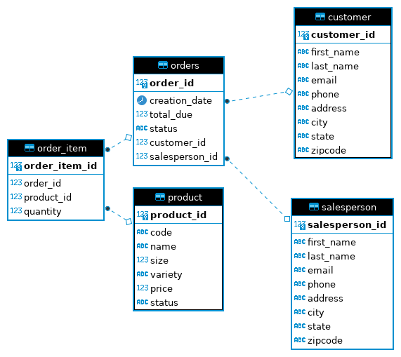

# JDBC API

# Introduction
Whether developers want to build mobile device apps for Android or web-based or desktop-based applications with the core Java SDK from Oracle, 
they must contend with the fact that many dynamic applications need to integrate data from a relational database.
Java Database Connectivity (JDBC) API, showing how to use it to read and manage data from relational databases such as Postgres, Oracle Database, MySQL, and SQL Server in applications programmed with Java.
This porject shows how to manipulate data from database through building JDBC API.

Technologies used:
- JDBC
- Maven
- Docker
- PostgreSQL


# Implementaiton
## ER Diagram



## Design Patterns
### Data Access Object (DAO) Pattern
DAO Pattern provide an abstraction layer between the raw JDBC code and the business logic. 
More specifically, The DAO provides an interface to the client for interacting with the database without the client needing to know the implementation details.
DAO is a class or interfaces that CRUD an object in your project. 
In general, an object could be one row in the database table or can also represent the result of your more complex query.

### Repository Pattern
Repository Pattern is an alternate pattern that many people use especially in the web applicaiton. 
The difference between them is that the repository pattern focuses only on single-table access per class.
the Repository pattern is often used in the distributed systems. 
The Repository is usually implemented as a single large table containing for a class and performs the business logic directly in code, 
rather then through SQL queries.

# Test
- Pull the PostgreSQL docker image and create a docker container instance of it with the `psql_docker.sh` script (file can be found at [scripts](https://github.com/jarviscanada/jarvis_data_eng_DanningJiang/tree/develop/linux_sql/scripts)).

- Create the database and tables with the sample data provided through following commands:
```
psql -h localhost -U postgres -f database.sql
psql -h localhost -U postgres -d hplussport -f tables.sql
```
- To start the app, a PostgreSQL container should be running so that the JDBC executor can establish a connection. 
From this point on, this connector can be used to create queries and fetch or modify the data.

- By running the main method in `JDBCExecutor` class which is the entry point of the JDBC app to test the various CRUD operations, and the outputs will show in console.

- The correctness of implementation is tested by running corresponding SQL queries in `DBeaver` and ensuring the database's changes are consistent with the operations in JDBC.


