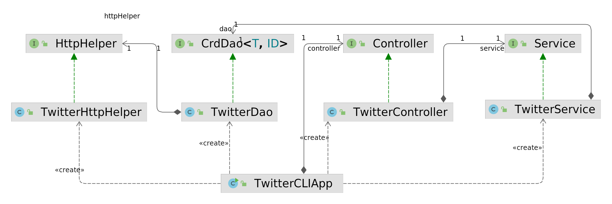
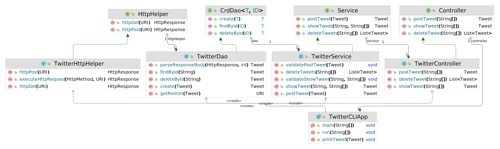

# Twitter CLI App
# Introduction
Twitter CLI App is a command line(CLI) tool written in Java which can post/show/delete Twitter post via Twitter REST API through the command line.
This TwitterApp is designed with the MVC architecture(design pattern). 
The app connects with Twitter REST API through HttpComponents library and OAuth library.
Also,Jackson JSON library is used for JSON processing.
Testing was done using JUnit and Mockito.
Maven was used to manage the project lifecycle. Spring framework was used to do the dependency management.
The application was deployed using Docker and pushed to Dockerhub.

Technologies that been used: Twitter REST API, HTTP client, mvn, Java libs, docker, etc.

# Quick Start
### To run the app:
 
### 1.Through the Jar
- set Twitter API keys as environment variables

`consumerKey = xxx`
`consumerSecret = xxx`
`accessToken = xxx`
`tokenSecret = xxx`
- create a jar package using maven

`mvn clean compile package`
- once the jar was built, run the app by executing

`java -jar twitter-1.0-SNAPSHOT.jar post|show|delete [options]`

### 2.Through Docker
- pull the image from docker hub

`docker pull dj717/twitter`
- run a docker container from that image with different commands
```
docker run --rm \
-e consumerKey=YOUR_VALUE \
-e consumerSecret=YOUR_VALUE \
-e accessToken=YOUR_VALUE \
-e tokenSecret=YOUR_VALUE \
dj717/twitter post|show|delete [options]
```
specific options as follows:

- post a tweet with given text and coordinates:
`post "tweet_text" "longitude:latitude"`
- show a tweet with given id and,optionally,selected fields:
`show id ["field1,field2,..."]`
- delete tweets with given ids:
`delete "id1,id2,..."`


# Design
The app is designed based on the MVC architecture and can be subdivided into 3 hierarchical layers, which are controller layer,service layer,
and data access layer.
## UML diagram
 <br>
---

> including methods
## Each component
### App/Main
The top layer is responsible for reading and parsing user inputs from the command line (passed in as program parameters). 
The program checks if the user has provided one of the three valid commands, and passes the instruction down to the controller layer.
### Controller
The controller layer interacts and parsers user input (CLI args in this APP). It also calls the service layer and returns results.
### Service
The service layer handles business logic and calls DAO layer in order to interact with the underlying storage/service which is the Twitter REST API in this app.
### Data Access Layer(DAO)
The data access layer handles models (entity-implemented with POJOs). In this app, the DAO layer save/show/delete tweet(s).

## Models
Tweet models are implemented with POJOs which is a class with private member variables and public getter and setters.
The Tweet object contains multiple fields such as ID, text, creation date, and other attributes that a typical tweet has. 
It also contains a Coordinates class for holding the longitude/latitude values of the corresponding Tweet location, and also an Entities class that holds hashtags and user mentions.
The Tweet object will be transferred to Tweet JSON object.

## Spring

Spring framework manage all dependencies. In the Spring framework, there are two most fundamental components, IoC container, and Beans.
IoC container will automatically create all components/dependencies in the correct order and set up everything.
In TwitterCLIApp, `TwitterController`, `TwitterService`, `TwitterDao`, and `TwitterHttpHelper` are Beans, and they are managed by the IoC container.

There are two approaches to manage the dependencies using Spring framework.

1. @Beans approach <br>
It defines dependency relationship using @Bean annotation and pass dependencies through method arguments, 
then creates an IoC container/context which will automatically instantiate all Beans base on the relationship you specified in the previous step.
Finally, it will get the main entry point (TwitterCLIApp) from the IoC container and start the program.

2. @ComponentScan approach <br>
Since we pass the dependencies through constructors when we implement an interface, 
we can use @Autowired annotation to tell IoC container to inject dependency through the constructor.
Also, we need add @Controller,@Service,@Repository those stereotypes of @Component from spring framework 
to indicate the annotated class is a Bean which will be managed by IoC container.

Thus, the Spring container scans the classes for the @Component and @Bean annotations. 
Then, it creates and supplies singleton instances of these classes into the constructors with the @Autowired annotation, when the later are called.

# Test
Each component was tested using Unit Tests as well as Integration Tests written in JUnit 4. 
Unit Tests were performed using Mockito.
Integration tests involve the tested classes and their dependencies (a group of classes or components).
Unit tests were performed using Mockito to ensure that each component works in isolation. 
Dependencies were mocked to return expected results to ensure that each part ran correctly.


## Deployment
Deployment by dockerizing the app.
- create a twitter/Dockerfile
```
cat > Dockerfile << EOF
FROM openjdk:8-alpine
COPY target/twitter*.jar /usr/local/app/twitter/lib/twitter.jar
ENTRYPOINT ["java","-jar","/usr/local/app/twitter/lib/twitter.jar"]
EOF
```
- login docker hub
```
docker_user = dj717
docker login -u ${docker_user} 
```
- package the java app

`mvn clean compile package`
- build a new docker image locally

`docker build -t ${docker_user}/twitter .`
- push the image to Docker Hub
  
`docker push ${docker_user}/twitter`

# Improvements
- Search and match pattern functionality can be added to allow users to search and match the tweets using other keywords not only by tweet id when they are doing show and delete options.
- Like delete option, we can let users show multiple tweets at the same time.
- New functionality like edit can be added to allow users modify their tweets and update them.
